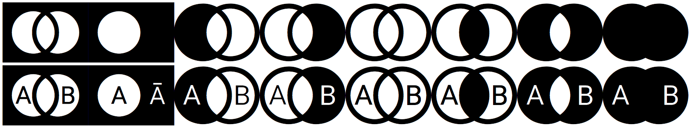

# Set Operation Icons
Icons for set operations, depicted as Venn diagrams



As there seems to be no free pack of icons for set operations, I have created my own. However, be warned that I am an amateur in this "icon creation" business and these icons have been created to be used for another project of my own.

## Usage

### As a font

To install the fonts of this project, download this repository and go to the [fonts](set-operations/fonts) folder. Here, you can find the files needed to install the fonts to your computer.

If you do not know which file format is the most appropriate for you, just install the [set-operations.ttf](set-operations/fonts/set-operations.ttf).

### In a web project

Download this repository and copy the `set-operations` folder into your project. In the `head` of your HTML file, link to the [set-operations.css](set-operations/css/set-operations.css) file as such:

```html
<link rel="stylesheet" href="path/to/set-operations/css/set-operations.css">
```

Next, to place an icon somewhere in your HTML file, use the prefix `set` and the icon name. For instance, to use the `union` icon:

```html
<span class="set set-union"></span>
```

The following icon names are available:

* `union`
* `intersect`
* `difference`
* `complement`: complement of one group
* `complement-AB`: complement of two united groups
* `difference-AB`: subtract group B elements from group A
* `difference-BA`: subtract group A elements from group B
* `symmetric-difference`
* `empty`

If you prefer the groups to be identified by the letters A and B, you can add the suffix `id` to the icon name:

```html
<span class="set set-union-id"></span>
```

You may also desire to change the icon style to improve their position according to the remaining text, as such:

```html
<span class="set set-intersect" style="font-size: 20px; line-height: 0; vertical-align: bottom; display: inline-block;"></span> Intersect groups
```

## Icon creation

The icons are based on the [circle-thin](http://fontawesome.io/icon/circle-thin) icon available from [Font Awesome](http://fontawesome.io). After creating the intended SVG files to represent set operations, [Glyphter](https://glyphter.com) was used to convert those files into fonts.

## License

As the icons are based on [Font Awesome](http://fontawesome.io), all the same licenses apply.

* Font license: [SIL OFL 1.1](http://scripts.sil.org/OFL)
* CSS license: [MIT License](http://opensource.org/licenses/mit-license.html)
